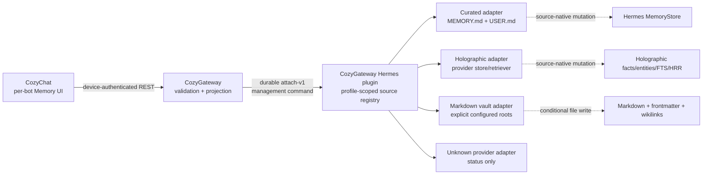

# Bot memory surface design

**Status:** proposed  
**Scope:** CozyChat + CozyGateway + the shipped upstream-Hermes CozyGateway plugin  
**Upstream baseline:** Hermes Agent `981101239a064c020a9d18fc3b1060ae306934ed`

## Decision

Build one bot-scoped **Memory** experience in CozyChat, backed by distinct
**Memory Sources**. The UI may federate search results, but the backend must
preserve each source's semantics, identity, capabilities, and mutation path.

For the first release, support:

1. Hermes curated memory (`MEMORY.md` and `USER.md`);
2. the active Holographic provider (`memory_store.db` through its provider
   API, never raw SQL from CozyGateway); and
3. explicitly configured Markdown vaults, including Obsidian-compatible
   vaults, through a dedicated vault adapter.

Unknown external providers remain visible as configured sources with honest
health and capability metadata. They are not editable until they have an
adapter.

## Why this is not one fact store

Cleo currently demonstrates three different domains:

| Human meaning | Concrete source | Native unit | Correct edit behavior |
|---|---|---|---|
| What Cleo keeps in prompt-ready notes | Hermes `MEMORY.md` | bounded `§` entry | validate, lock, safety-scan, enforce capacity; active next session |
| What Cleo knows about the user | Hermes `USER.md` | bounded `§` entry | same storage rules, separate purpose and capacity |
| Recallable structured facts | Holographic | fact row plus entities/vector/index | provider update so FTS, entity links, HRR bank, and trust stay coherent |
| A durable knowledge garden | Obsidian-compatible Markdown vault | note with frontmatter and wikilinks | preserve path/frontmatter/links and detect file conflicts |

Flattening these into a common database would duplicate private content,
erase provider meaning, and create two sources of truth. The only normalized
shape should be the small read envelope CozyChat needs to render a result.

## Two designs considered

### A. CozyGateway reads Hermes files and databases

The Gateway could use Hermes Dashboard file endpoints or direct host paths,
parse Markdown, and open Holographic SQLite itself.

This is initially short, but it gives the wrong process ownership. Hosted
CozyGateway cannot assume local filesystem access; direct SQLite writes bypass
provider invariants; arbitrary provider storage may be remote; and every new
provider would expand secrets and dependencies in the public-facing service.

**Rejected.** The Gateway is a transport and projection boundary, not a memory
database administrator.

### B. Provider adapters run beside Hermes

The shipped CozyGateway Hermes plugin exposes a bounded management command
channel over attach-v1. Adapters execute inside the selected profile's Hermes
home and call upstream storage/provider APIs. CozyGateway validates and
forwards commands, authenticates the phone, and returns normalized results.

**Selected.** It preserves profile isolation, works when the Gateway is hosted,
uses upstream behavior without a Hermes fork, and keeps provider complexity
behind one deep agent-side module.

The existing upstream profile-scoped `/api/learning/graph` is useful evidence
and can accelerate a read-only prototype for curated entries. It is not the
product contract: it omits external providers and identifies entries by list
position, which becomes stale when another writer changes the file.

## Architecture



### Agent-side deep module

The plugin owns one small interface:

```text
MemorySourceAdapter
  describe() -> source metadata + health + capabilities
  search(query, filters, cursor, limit) -> page of source-native summaries
  get(itemID) -> full item + revision
  create(input) -> item
  update(itemID, expectedRevision, patch) -> item
  remove(itemID, expectedRevision) -> receipt
```

Capabilities are data, not assumptions:

```text
search, browse, create, edit, delete, feedback, relationships, backlinks,
categories, tags, trust, capacity, effectiveNextSession
```

An unsupported provider can therefore return `search=false`, `edit=false`, and
a useful health explanation without breaking the whole page.

### Wire and REST surface

Add memory management commands to attach-v1 as a separate bounded channel from
turn traffic. Commands and replies use durable sequence/ack behavior; raw
memory never appears in heartbeats, push payloads, or logs.

Phone-facing routes follow the existing bot extension:

```text
GET    /bots/:name/memory
GET    /bots/:name/memory/items?q=&source=&kind=&cursor=&limit=
GET    /bots/:name/memory/sources/:source/items/:id
POST   /bots/:name/memory/sources/:source/items
PATCH  /bots/:name/memory/sources/:source/items/:id
DELETE /bots/:name/memory/sources/:source/items/:id
```

Writes carry `expectedRevision` in the validated body. A stale revision returns
`409 conflict` with no write. Search limits and snippets are bounded. The
Gateway caches source metadata briefly but does not persist or index memory
content.

The shared item envelope stays deliberately shallow:

```json
{
  "id": "fact:42",
  "source": "holographic",
  "kind": "fact",
  "title": "Concise first line",
  "snippet": "Bounded preview",
  "updatedAt": 1787462400000,
  "revision": "opaque-source-revision",
  "attributes": {}
}
```

`attributes` is validated per source. It is not an unbounded JSON escape hatch.

### Identity and concurrency

- Curated entry ID: deterministic content fingerprint scoped to `memory` or
  `user`. Revision: whole-file fingerprint plus entry fingerprint. An edit
  returns the new ID and forces a page refresh. This is simpler and safer than
  maintaining a sidecar UUID map for two tiny bounded files.
- Holographic ID: upstream `fact_id`. Revision: `updated_at` plus content
  fingerprint. All writes call the provider store so dependent indexes rebuild.
- Vault ID: normalized relative path, never an absolute host path. Revision:
  file-content fingerprint. Rename is a later explicit operation because it can
  change backlinks.

## CozyChat information architecture

Memory belongs inside each bot's settings sheet as **Memory**, alongside Edit
and Routines. That makes the bot selector the privacy boundary and avoids a
global drawer destination that silently mixes identities.

The first screen answers four questions in order:

1. What memory systems does this bot use?
2. Are they healthy and writable?
3. What does the bot remember about this query?
4. Where did each result come from, and what happens if I edit it?

Recommended layout:

```text
Cleo                                      Memory

Search Cleo's memory
[ All ] [ Notes ] [ About me ] [ Facts ] [ Vault ]

Memory sources
  Curated notes        6 entries      Near capacity
  About me             5 entries      Near capacity
  Holographic          286 facts      Configuration needs review
  Cleo's vault         379 notes      Available

Recent / search results
  [FACT] Project convention...          Trust 0.90  Today
  [ABOUT ME] Prefers concise reports...             Aug 22
  [VAULT] Gateway reliability review...  4 links     Aug 23
```

Design rules:

- Search/list is the default. A graph is an optional source-specific view, not
  the front door.
- Every result always carries its source label. “All” never hides provenance.
- Selecting an item opens a detail view with content, source, metadata,
  effective timing, and only the actions that source supports.
- Curated memory shows used/available capacity before editing.
- Holographic offers category, tags, trust, entities, helpful/unhelpful
  feedback, and an optional relationship view.
- Vault search supports title/body/tags/path; detail preserves frontmatter and
  renders wikilinks/backlinks. The default editor edits the note body without
  casually rewriting frontmatter.
- A saved curated edit says “Saved. Cleo will use this in the next session.”
- A conflict shows the current version and the user's draft; it never silently
  overwrites an agent's newer write.

## Discovery and configuration

Automatic discovery is intentionally narrow:

- built-in curated stores come from upstream memory configuration;
- the one active external provider comes from `memory.provider` and is matched
  to a registered adapter; and
- Markdown vaults require explicit plugin configuration with a display name
  and root path. Do not scrape arbitrary skill prose for paths at runtime.

The source overview validates canonical provider configuration. In Cleo's
current profile, Holographic is active but settings are under
`plugins.holographic`; current upstream reads `plugins.hermes-memory-store`.
The UI should report this as degraded configuration rather than claiming that
auto-extraction or the configured trust default is active.

## Security and privacy

- Bot/profile name is mandatory on every operation and is resolved by the
  already-authenticated plugin connection. No cross-profile path input exists.
- Vault paths are configured agent-side and never returned to the phone.
- No memory text in APNs, telemetry, request logs, error logs, or health frames.
- Search and item responses are bounded; source errors are redacted.
- Human deletes require native confirmation. The Gateway records a redacted
  audit event (who/source/item/action/time), not the deleted content.
- Full-content audit/undo snapshots stay encrypted on the Hermes host if added;
  they do not become a second hosted memory store.
- Threat scanning and source invariants remain in the source-native mutation
  path. CozyChat never edits files or SQLite directly.

## Delivery slices and acceptance

### Slice 1: truthful read-only overview

- Source discovery per bot, including unavailable/unsupported/degraded states.
- Curated entry list and capacity; Holographic counts/categories; explicit
  vault metadata.
- No raw content cached in CozyGateway.

### Slice 2: federated search and detail

- Search curated text, Holographic native retrieval, and vault Markdown.
- Stable pagination, bounded results, source labels, detail loading.
- One unavailable source does not fail results from healthy sources.

### Slice 3: safe human editing

- Conditional create/edit/delete per supported source.
- Concurrent agent change produces a conflict, never data loss.
- Holographic content edit demonstrably refreshes FTS, entities, and HRR data.
- Curated limit, lock, injection scan, and next-session semantics are preserved.
- Vault frontmatter/wikilinks round-trip byte-safely.

### Slice 4: relationship and audit views

- Holographic entity/fact exploration and Obsidian backlinks.
- Redacted mutation audit and source-change invalidation event.

Contract tests should run every adapter against the same capability suite,
then add source-specific invariant tests. End-to-end tests must cover mixed
sources, read-only/unknown providers, reconnect during search, stale revisions,
profile isolation, Unicode Markdown, and a source disappearing mid-page.

## Non-goals

- No Hermes fork.
- No universal provider database or hosted mirror.
- No automatic cross-bot search in the first release.
- No arbitrary filesystem browser.
- No claim that an AI-generated fact is true; source, trust, feedback,
  contradictions, and human history remain visible.

## Evidence

See [the pinned upstream research](../research/hermes-memory-visualization-primary-research-2026-08-23.md)
for the source-backed Hermes behavior and provider limitations behind this
design.
